# Frontend Documentation

## Architecture

The application is a single-page application built with React 19 and bundled with Vite 8. Routing between screens is handled entirely on the client using React Router v7 (`BrowserRouter`), and the codebase is organized using a feature-based structure rather than a type-based one: each functional area of the hospital system (authentication, reception, doctor workflows, analytics, and so on) lives in its own folder under `src/features`, with its own pages, components, and, in some cases, its own data-access logic. This structure was chosen so that each module could be developed and extended independently while still sharing a common authentication layer, layout system, and routing entry point.

Styling is implemented primarily with Tailwind CSS utility classes, used throughout the Authentication, Reception, Doctor, and Shared screens for fast, consistent UI development. The analysis dashboards use inline JavaScript style objects together with a small shared color palette (`Analysis/constants/theme.js`) for their visual design. Icons are supplied by the `lucide-react` library, and data visualizations (trend lines, bar charts, pie charts) are built with `recharts`.

Communication with the backend is centralized through a single fetch wrapper, `features/APIS/apiHandler.js`. This module is the primary data-access layer for Authentication, Reception, Doctor, and the Shared Tasks/Alerts pages: it builds the full request URL, automatically attaches the stored bearer token to every request, and exposes one exported function per backend endpoint, so that screens never construct HTTP requests by hand. A short example of the core request logic:

```js
export const apiRequest = async ({ method = 'GET', url, data, params, headers = {} }) => {
  const fullUrl = buildUrl(url, params);
  const token = getStoredToken();

  const requestHeaders = {
    'Content-Type': 'application/json',
    ...(token ? { Authorization: `Bearer ${token}` } : {}),
    ...headers,
  };

  const response = await fetch(fullUrl, {
    method: method.toUpperCase(),
    headers: requestHeaders,
    ...(data !== undefined ? { body: JSON.stringify(data) } : {}),
  });

  if (response.status === 401) clearAuthToken();
  // ...parse JSON response and throw on non-2xx status
};
```

Centralizing the request and token logic in one place means every screen that needs data simply imports a named function (`getPatients`, `createPatient`, `assignBed`, and so on) and gets authentication, JSON parsing, and error handling for free, instead of repeating that logic in every component.

Real-time updates are implemented with the `@microsoft/signalr` client library, wrapped in a custom hook and React context (`features/APIS/useSignalR.jsx`), so that any screen can subscribe to live hospital events without managing the socket connection itself. This is described in more detail in the API Integration section.

For application-wide state shared across multiple screens, the project primarily uses React's Context API. This approach was chosen to provide a flexible and easily maintainable solution for managing data that needs to be accessed by both the Reception and Doctor modules, such as authenticated user information, patient-related context, and other shared application data. React Context offers a lightweight mechanism for state sharing without introducing additional architectural complexity. Since the Reception and Doctor workflows require different sets of data and may evolve independently over time, Context allows each feature area to define and customize its own providers and state structure while maintaining clear separation of concerns. This improves scalability, simplifies integration between modules, and makes future modifications easier as requirements change. The app is also wrapped in a `QueryClientProvider` (TanStack Query), set up at the root of the application so that async data caching is available as the data layer grows.

Authentication state is persisted to `localStorage` under a single key (`ishms-auth`), so a page refresh does not log the user out; the stored value is the full response returned by the login endpoint (token, role, expiry, and basic profile fields). The base API URL is read from the `VITE_API_BASE_URL` environment variable, which keeps the same build deployable against different backend environments without code changes. Before the app mounts, `main.jsx` also fetches a small `config.json` file to set an `apiMode` flag, which gives the project a single place to configure the application's data-access mode per deployment.

For deployment, the repository includes a minimal Express server (`server.js`) that serves the Vite production build (`dist/`) and falls back to `index.html` for any unmatched route, which is what allows client-side routing to keep working correctly on a full page refresh.

## Folder Structure

The relevant parts of the project structure, based on the file tree and the source files reviewed, are as follows:

```
src/
├── App.jsx                  // Top-level route definitions and role-based layout switching
├── main.jsx                 // Application entry point; loads config.json before mounting
├── features/
│   ├── AuthPage.jsx          // Login screen
│   ├── Auth/
│   │   └── AuthProvider.jsx  // Authentication context (login, logout, token)
│   ├── APIS/
│   │   ├── apiHandler.js     // Central fetch wrapper and all backend endpoint functions
│   │   ├── Handler.js        // ID/department formatting helpers (bed IDs, patient IDs)
│   │   └── useSignalR.jsx    // SignalR connection hook, context, and provider
│   ├── Shared/
│   │   ├── Layout.jsx        // Sidebar + header shell used by Reception and Doctor roles
│   │   ├── IContext.jsx      // Application data context (patients, alerts, search, SignalR routing)
│   │   ├── alerts.jsx        // Shared Alerts inbox page
│   │   ├── tasks.jsx         // Shared Task board page
│   │   ├── Assign.jsx        // TransferModal component (bed reassignment)
│   │   └── SignalRNotifications.jsx   // Notification bell and dropdown
│   ├── Reception/
│   │   ├── Dashboard.jsx
│   │   └── components/
│   │       ├── AdmissionWizard.jsx
│   │       ├── BedManagement.jsx
│   │       ├── DischargeMonitor.jsx
│   │       └── PatientDetailsModal.jsx
│   ├── Doctor/
│   │   ├── Dashboard.jsx
│   │   ├── PatientDetail.jsx
│   │   └── components/
│   │       └── patientDetails/
│   │           ├── drugcheck.jsx
│   │           ├── isbar.jsx
│   │           ├── MedicalReport.jsx
│   │           └── tasks.jsx
│   ├── Analysis/
│   │   ├── ExecutiveDashboard.jsx
│   │   ├── ClinicalDashboard.jsx
│   │   ├── OperationsDashboard.jsx
│   │   ├── components/        // KpiCard, WCard, Sidebar, SideHeroCard, SectionHeader,
│   │   │                      // RiskBadge, PillsFilter, CustomTooltip, EmptyState,
│   │   │                      // Skeleton, TopBar, Layout
│   │   ├── constants/         // endpoints.js, theme.js, thresholds.js
│   │   ├── hooks/useApi.js
│   │   ├── services/api.js
│   │   ├── utils/helpers.js
│   │   └── assets/            // background images and icons used by the dashboards
│   ├── Admin/                 // Admin module, integrated into the application's routing
│   └── Nurse/                  // Nurse module, integrated into the application's routing
└── styles/                     // Global CSS (app.css, globals.css, index.css)
```

The `Admin` and `Nurse` folders belong to the wider ISHMS application and are wired into the same router, authentication layer, and provider tree as the rest of the app; this document focuses on the Authentication, Reception, Doctor, and Shared modules, plus how all of the modules are combined together.

## Routing

Routing is defined in a single file, `src/App.jsx`, using React Router's `BrowserRouter`, `Routes`, and `Route` components, combined with three custom wrapper components: `RequireAuth`, `RoleAwareLayout`, and `RoleAwareDashboard`. The goal of this layer is to let every module in the application — regardless of which part of the team built it — be merged into one router and one authentication flow, while each role still gets the experience built specifically for it.

**Authentication guard.** `RequireAuth` reads the current user from `AuthProvider` (`useAuth()`); if no user is present, it redirects to `/login`. Every route tree in the application is wrapped in `RequireAuth`, so a single guard component protects the whole app rather than each module re-implementing its own check.

**Public route.** `/login` renders the `AuthPage` component, which handles the sign-in form and credential submission.

**Role-based merge.** Once authenticated, the user's role determines which route tree they land in. This is the core of how the different modules are combined into one application: receptionist and doctor accounts are routed into the main `"/"` tree (the part built for this project), while the admin and nurse modules are mounted at their own dedicated route trees, `/admin/*` and `/nurse/*`, using the same `RequireAuth` guard and the same role-detection pattern. `RoleAwareLayout` is the component that performs this branching:

```jsx
function RoleAwareLayout() {
  const auth = useAuth();
  const role = auth?.user?.role?.toLowerCase();

  if (role === "admin") return <Navigate to="/admin" replace />;
  if (role === "nurse") return <Navigate to="/nurse" replace />;

  const Layout = role === "receptionist" ? ReceptionLayout : DoctorLayout;
  return <Layout user={auth.user} />;
}
```

`ReceptionLayout` and `DoctorLayout` both point to the same underlying component, `Shared/Layout.jsx`, so Reception and Doctor share one navigation shell. This means UI updates to the shared shell — the sidebar, header, search bar, and notification bell — apply to both roles at once, instead of having to be maintained twice.

**Nested routes under `"/"`.** Inside the Reception/Doctor shell, the following routes are defined as children of the layout route, all rendered into the shell's `<Outlet />`:

- `index` and `dashboard` — render `RoleAwareDashboard`, which renders the dashboard that matches the current role (`ReceptionDashboard` or `DoctorDashboard`).
- `TasksPage` and `AlertsPage` — render the Shared `TasksPage` and `AlertsPage` components, reused by both roles.
- `doctor` and `patients/:id` — render `DoctorDashboard` and `PatientDetail`.
- `reception`, `reception-tasks`, `admission`, `beds`, `discharge` — all render `ReceptionDashboard`, which reads the current URL path internally to decide which tab to display (overview, admission wizard, bed management, or discharge monitor).
- `reception/patient/:id` — renders `PatientDetailsModal` as a routed page.
- `alerts` — also renders `AlertsPage`.
- `executive`, `clinical`, `operations` — render the three analysis dashboards.
- A catch-all `*` renders a shared NotFound page.

**Provider composition.** Around the `Routes` tree, `App.jsx` nests `QueryClientProvider`, `BrowserRouter`, `AuthProvider`, a SignalR bridge that supplies the live connection with the current auth token, the Shared data provider (`IContext`), and a global `ThemeProvider`, in that order. Wrapping the whole router in this single provider stack is what allows every module — Reception, Doctor, Admin, and Nurse alike — to share one authentication session and one set of application-wide providers, rather than each module managing its own.

## State Management

- **`AuthProvider` (`features/Auth/AuthProvider.jsx`)** holds the authenticated user object, the bearer token, an `authLoading` flag, and an `authError` message. It exposes `login` and `logout` actions. On mount, it rehydrates its state synchronously from `localStorage` so that a page refresh does not log the user out. A successful login response is normalized into a consistent user shape (`email`, `fullName`, `roles`, `role`, `tokenExpiration`) before being placed in state.
- **`IContext` / `useData` (`features/Shared/IContext.jsx`)** is the main shared data context for the Reception/Doctor shell. On mount (and whenever the user's role changes), it fetches the full patient list and the alert list for the current role in parallel, filters out discharged patients, and exposes derived selectors (`getPatientById`, `getPatientsByStatus`, `getAlertsByType`, `getLatestAlerts`) plus a free-text `searchTerm`/`filteredPatients` pair used by the global search bar in the layout header. It also defines `handleSignalREvent`, a dispatcher built to patch the in-memory patient list directly in response to live SignalR events, which is described further in the API Integration section.
- **`SignalRContext` (`features/APIS/useSignalR.jsx`)** holds the live connection status (`connecting`/`connected`/`reconnecting`/`disconnected`), the list of alert notifications received over the socket, and an unread count, along with actions to mark items read or dismiss them.
- Beyond these three contexts, individual screens manage their own UI state locally with `useState` — for example, the multi-step form state in `AdmissionWizard`, the active tab and modal-visibility flags in `PatientDetail`, and the grid/list view toggle and search/filter state in `BedManagement`.

Keeping these three contexts separate — one for identity, one for shared clinical data, and one for the live connection — keeps each concern easy to reason about on its own, while still letting any screen in the Reception/Doctor shell read from all three through a simple hook call.

## Main Screens

### Login (`AuthPage.jsx`)

**Purpose.** The entry point of the application, where a user signs in to reach their role-specific dashboard.

**Main functionality.** The component holds the email/password form state and, on submit, calls `auth.login({ email, password })` from `AuthProvider`. If the user is already authenticated, an effect redirects them straight to `/` so they never see the login form unnecessarily. Once `AuthProvider` resolves the login, the role-based routing logic described above takes over and sends the user to the dashboard built for their role.

**Key UI elements.** A centered card with an animated entrance, the ISHMS logo, email and password fields with a show/hide toggle on the password field, an inline error banner for validation or server-side messages, and a submit button that displays a loading label while the request is in flight.

**Interaction with APIs or state management.** All authentication logic is delegated to `AuthProvider`; the page itself holds no token logic and calls `auth.login` exclusively.

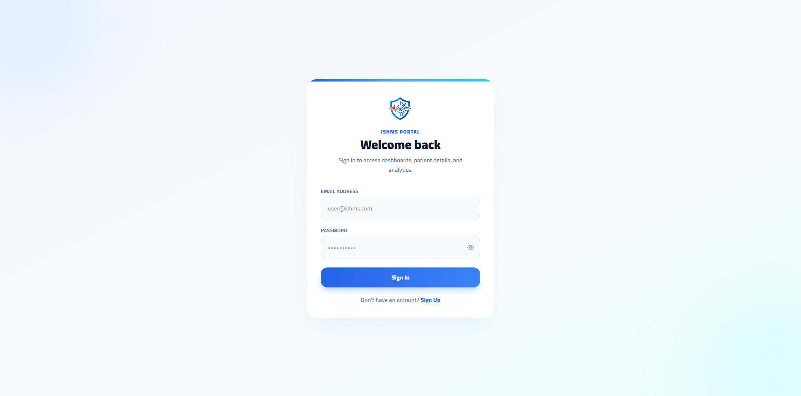

### Reception Dashboard (`Reception/Dashboard.jsx`)

**Purpose.** The main working screen for receptionist users, providing an overview of ward occupancy and acting as a shell for several internal tabs.

**Main functionality.** `ReceptionDashboard` reads the current URL path and maps it to an internal tab key, then renders the corresponding tab content: an `Overview` view built directly inside this file, or one of `AdmissionWizard`, `BedManagement`, `DischargeMonitor`, or the Shared `AlertsPage`. The Overview tab shows three KPI cards (Total Admitted, Ready to Discharge, Active Alerts), a list of the five most recently admitted patients, a quick-actions grid (New Admission, Bed Map, Active Alerts, Daily Reports, Discharges, Activity Logs), and a discharge queue showing stable patients sorted by admission time. The dashboard also embeds the Executive analysis dashboard as one of its tabs, giving receptionists direct access to hospital-wide analytics without leaving their own working screen.

**Key UI elements.** KPI cards, a patient row list with status-colored avatars, a discharge queue with inline "Discharge" and "View" actions, a quick-action button grid, and an embedded `PatientDetailsModal` triggered from either list.

**Interaction with APIs or state management.** Patient and alert data come from `useData()` (the shared `IContext`); the dashboard triggers `refreshData()` on mount to make sure the shared context has loaded data for the current session.

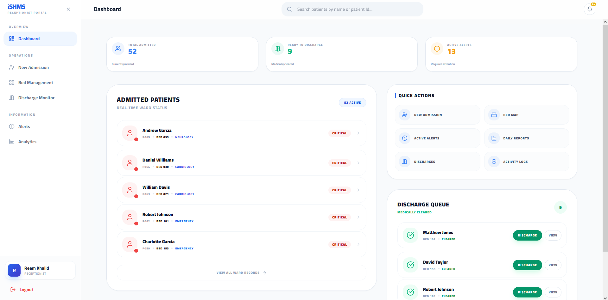

#### Admission Wizard (`Reception/components/AdmissionWizard.jsx`)

**Purpose.** A three-step guided form for admitting a new patient: Identity, Placement, and Review. Breaking admission into steps keeps the form approachable and reduces the chance of a receptionist submitting incomplete information.

**Main functionality.** Step one collects the patient's full name and date of birth, automatically computing age from the date of birth. Step two loads the list of departments (`getDepartments`) and, once a department is chosen, loads the available beds for that department (`getAvailableBedsByDepartment`), so a receptionist can only pick a bed that is actually free. Step three reviews the entered data and submits it with `createPatient`, after which a success state is shown and the shared patient list is refreshed so the new admission appears immediately across the dashboard.

**Key UI elements.** A step indicator at the top, per-step form fields, a department dropdown that dynamically reveals a bed dropdown, and Back/Continue/Confirm navigation buttons.

**Interaction with APIs or state management.** Calls `getDepartments`, `getAvailableBedsByDepartment`, and `createPatient` from `apiHandler.js`.

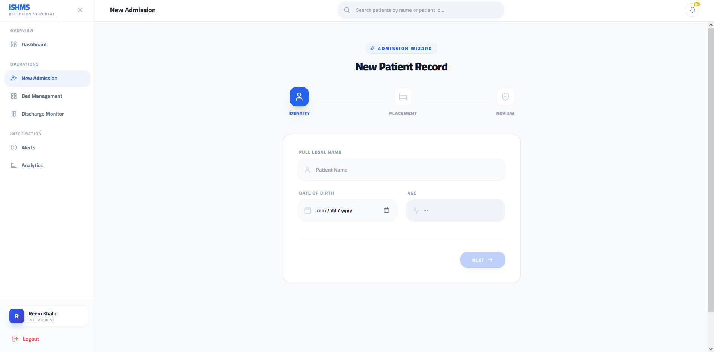

#### Bed Management (`Reception/components/BedManagement.jsx`)

**Purpose.** A ward-wide view of bed occupancy across all departments, supporting both grid and list views so staff can pick whichever layout suits the task at hand.

**Main functionality.** On mount, the component loads departments, available beds, and occupied beds in parallel (`getDepartments`, `getAvailableBeds`, `getOccupiedBeds`) and builds an occupancy map. It supports filtering by `all` / `available` / `occupied`, free-text search by bed or patient name, and switching between a card-grid layout and a table-style list layout. Selecting an occupied bed opens the shared `TransferModal` (from `Shared/Assign.jsx`), which lets staff move a patient to a different department by calling `assignBed`.

**Key UI elements.** Summary cards (Total Beds, Available, Occupied, Critical), a search field, filter pills, a grid/list view toggle, per-bed cards or rows color-coded by status, and the transfer modal.

**Interaction with APIs or state management.** Reads bed/department data through `apiHandler.js` (`getDepartments`, `getAvailableBeds`, `getOccupiedBeds`) and performs transfers through `assignBed`, also from `apiHandler.js`, via the shared `TransferModal` component.

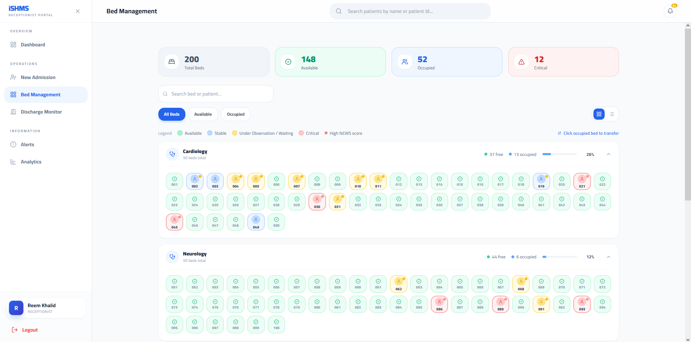

#### Discharge Monitor (`Reception/components/DischargeMonitor.jsx`)

**Purpose.** A dedicated queue for patients who are medically cleared and ready to be discharged.

**Main functionality.** Reads the shared patient list from `useData()`, filters it to stable patients, computes each patient's length of stay, and lets staff select a patient, choose a discharge type (Home, Transfer, etc.) and add notes, then confirm the discharge.

**Key UI elements.** A sortable discharge queue list, a confirmation panel with discharge-type selection and a notes field, and a success notification once a discharge completes.

**Interaction with APIs or state management.** Calls `dischargePatient(patientId)` from `apiHandler.js` and then calls `refreshData()` from the shared `IContext` to refresh the patient list afterward.

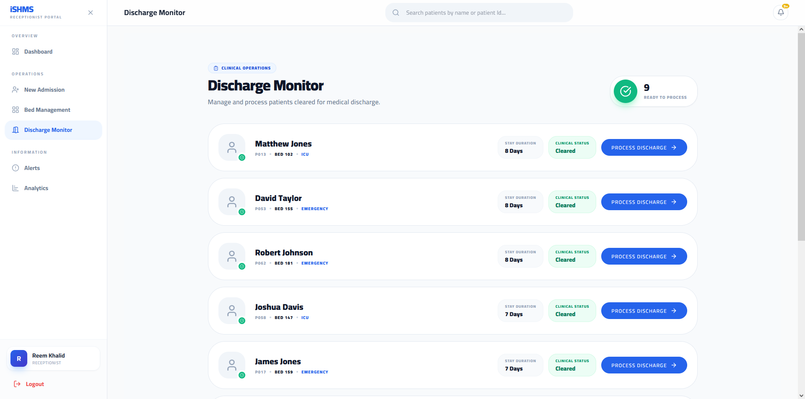

### Doctor Dashboard (`Doctor/Dashboard.jsx`)

**Purpose.** The doctor's landing screen, summarizing their patient load by acuity and surfacing recent alerts and tasks in one place.

**Main functionality.** Reads the shared patient list from `useData()` and sorts it by clinical priority (Critical, then Unstable, then Stable, then by NEWS score), so the patients who need attention first are always at the top. It independently fetches the doctor's own medical reports (`getMedicalReportsByDoctor`), fetches role-based tasks (`getTasksByRole`), and renders a grid of patient cards, filterable by clicking one of four status stat cards (Critical, Unstable, Stable, All). Below the patient grid, an Alerts section and a Tasks section let the doctor expand individual items, mark alerts as read (`markAlertRead`), mark tasks complete (`completeTask`), and jump straight to a patient's detail page.

**Key UI elements.** Status-filter stat cards, a responsive grid of patient cards showing key vitals and a NEWS-style severity indicator, and two collapsible list sections for alerts and tasks.

**Interaction with APIs or state management.** Patient data comes from the shared `IContext`; alerts, tasks, and medical reports are fetched directly in this component using `apiHandler.js` functions (`getTasksByRole`, `getMedicalReportsByDoctor`, `markAlertRead`, `completeTask`).

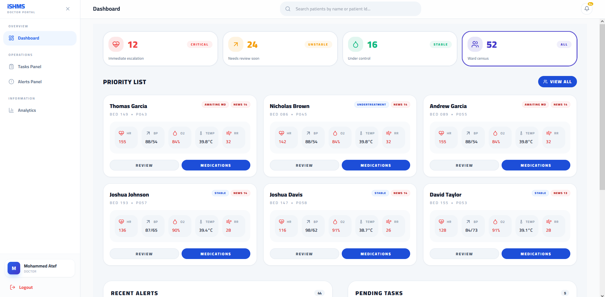

### Patient Detail (`Doctor/PatientDetail.jsx`)

**Purpose.** A single-patient deep-dive screen for doctors, combining vitals history, medication information, and clinical/handover documentation in one place.

**Main functionality.** On load, the screen fetches the patient record, their medical reports, their ISBAR handover summary, and their tasks in parallel (`getPatientById`, `getMedicalReportsByPatient`, `getPatientIsbar`, `getTasksByPatient`). Content is organized into three tabs:

- **Vitals** — five selectable vital-sign cards (heart rate, systolic blood pressure, temperature, oxygen level, respiration rate); selecting one renders a trend chart for that vital using `recharts`, alongside background history and current flow-status panels.
- **Medications** — shows the patient's current treatment summary and previous-medications history.
- **Clinical Notes** — a clinical profile (identity, background, current status/flow, and, when available, the ISBAR Identify and Assessment sections).

Beyond the tabs, action buttons open four modal dialogs: a Drug Interaction Check (`DrugCheckModal`, calling `checkPatientMedication`), an ISBAR report viewer (`ISBARModal`), a Tasks viewer (`TasksModal`), and a Medical Report editor (`MedicalReportModal`, calling `createMedicalReport`).

**Key UI elements.** A patient header (name, bed, department, age), three navigation tabs, an interactive vitals chart, treatment/history panels, and four modal dialogs for drug checking, ISBAR review, task review, and report authoring.

**Interaction with APIs or state management.** This screen fetches its own data directly through `apiHandler.js` rather than relying on the shared `IContext`, since it needs patient-specific endpoints (`getPatientById`, `getMedicalReportsByPatient`, `getPatientIsbar`, `getTasksByPatient`, `checkPatientMedication`, `createMedicalReport`, `completeTask`).

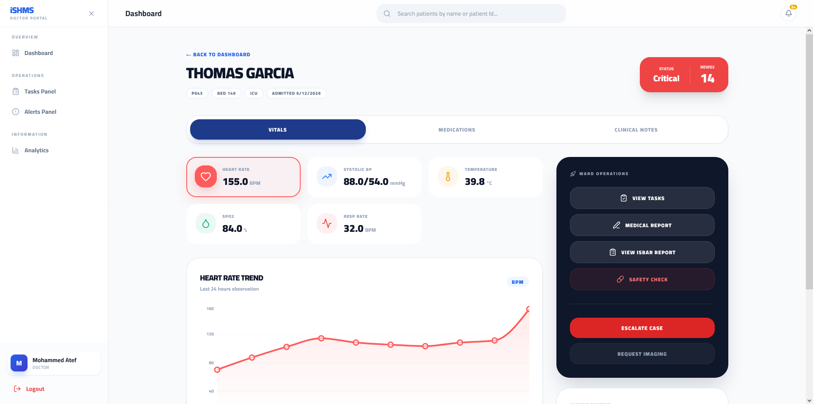
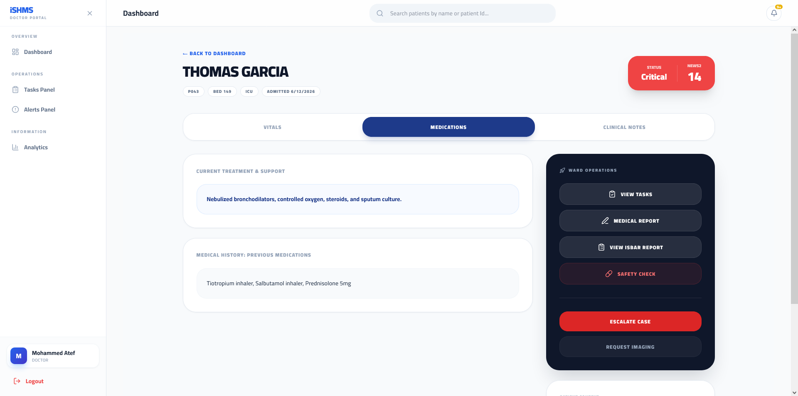
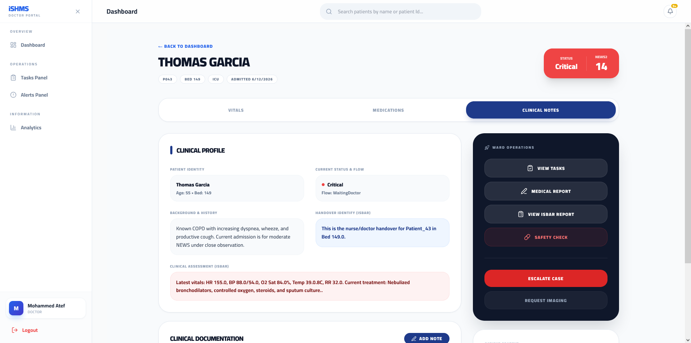
### Analysis Dashboards (Executive, Clinical, Operations)

**Purpose.** Three analytics dashboards reachable at `/executive`, `/clinical`, and `/operations`, built for hospital-wide monitoring rather than individual patient care, and integrated into the application alongside the Reception and Doctor modules.

**Main functionality.**

- **Executive Dashboard** shows five top-line KPI cards (Active Patients, Bed Occupancy, Average NEWS Score, Critical Alerts, Overdue Tasks), a seven-day alert trend area chart, a department load index, a risk-distribution pie chart, and an overdue-tasks-by-department bar chart.
- **Clinical Dashboard** shows a risk board listing patients sorted by risk level and NEWS score with color-coded risk badges, a live alert feed, and a risk-distribution pie chart, refreshed on a fixed polling interval.
- **Operations Dashboard** shows bed-related KPIs (Total Capacity, Occupancy Rate, Available Beds, Bed Turnaround), a bed-occupancy map, peak-hours data, and a bed-shortage-risk indicator, with a filter control for narrowing the view.

All three dashboards share a common `Layout` and `Sidebar` for navigating between Executive, Clinical, and Operations.

**Key UI elements.** KPI cards, section headers with a manual refresh control, card containers, risk badges, loading skeletons, empty-state placeholders, and `recharts`-based area, bar, and pie charts.

**Interaction with APIs or state management.** Each dashboard uses a custom `useApi(url, intervalMs)` hook, pointing at endpoints defined in `Analysis/constants/endpoints.js`. The hook fetches JSON data and automatically re-fetches it on the given interval, keeping the dashboards up to date without requiring a manual refresh.


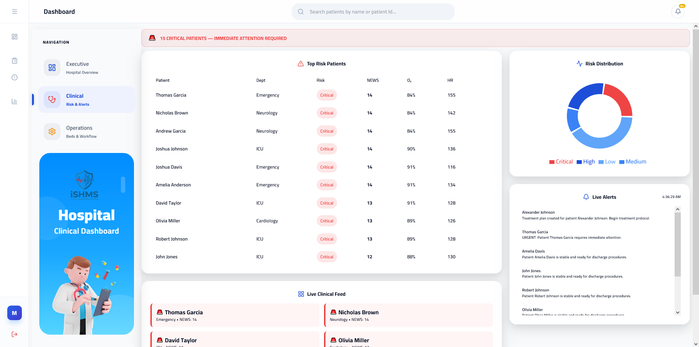

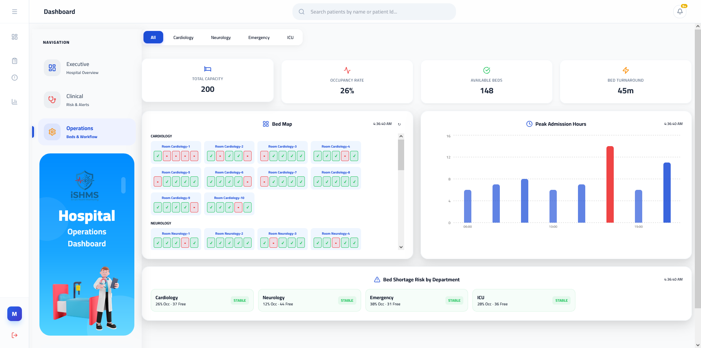

## Components

### Shared layout and navigation

**`Shared/Layout.jsx` (`MainLayout`)** is the shell used by both the Reception and Doctor route trees. It renders a collapsible left sidebar (with role-specific navigation items — Admission/Beds/Discharge/Alerts/Analytics for receptionists, Tasks/Alerts/Analytics for doctors), a sticky header containing a live patient search box (results pulled from the shared `IContext`'s `filteredPatients`) and the notification bell, and a content area that renders the active route via `<Outlet />`. It also defines and exports `SearchContext`, used by a few child screens (such as `AlertsPage` and `AdmissionWizard`) to read the header's current search term.

**`Shared/SignalRNotifications.jsx`** is the notification bell shown in the header. It connects to `useSignalRContext()` to read connection status and the stored alert list, and renders a dropdown panel listing recent alerts with their severity, with controls to mark individual alerts read, mark all as read, or view all alerts.

### Shared content pages reused across roles

**`Shared/tasks.jsx` (`TasksPage`)** and **`Shared/alerts.jsx` (`AlertsPage`)** are full pages, reused as routed pages for both Reception and Doctor. `TasksPage` fetches role-scoped tasks (`getTasksByRole`), shows stat cards for All/Pending/Completed, and lets the user expand a task to see details and mark it done (`completeTask`). `AlertsPage` fetches role-scoped alerts (`getAlertsByRole`), shows stat cards by severity, and lets the user expand an alert to view it and mark it read (`markAlertRead`), with a "View Patient" action that opens either the `PatientDetailsModal` (for receptionists) or navigates to `PatientDetail` (for doctors), based on the role flags from `IContext`. Building these as shared pages rather than role-specific duplicates keeps the task and alert experience consistent everywhere they appear.

### Shared modal

**`Shared/Assign.jsx` (`TransferModal`)** is a confirmation modal for reassigning a patient to a different department/bed. It displays the patient's current status, NEWS score, and time since admission, a department selector, and a confirm button that calls `assignBed`. It is used by `BedManagement.jsx`.

### Reception-specific components

**`PatientDetailsModal.jsx`** is a patient summary view (demographics, bed, NEWS score, status, and any recorded background/medication/treatment notes), used both as a route (`reception/patient/:id`) and as an inline modal from the Reception Dashboard and Alerts page.

### Doctor-specific modals

The four components under `Doctor/components/patientDetails/` are modal dialogs opened from `PatientDetail.jsx`: **`drugcheck.jsx`** (`DrugCheckModal`) submits a drug-interaction check request for the patient and displays the result; **`isbar.jsx`** (`ISBARModal`) renders a formatted view of the patient's ISBAR handover record; **`tasks.jsx`** (`TasksModal`) displays the patient's task list; and **`MedicalReport.jsx`** (`MedicalReportModal`) provides a form for authoring a medical report, calling `createMedicalReport` on save.

### Analysis reusable components

The Analysis module has its own small component library, used across its three dashboards: **`KpiCard`** (a single metric tile with an icon, value, and optional unit), **`WCard`** (a card container with consistent shadow/border styling), **`SectionHeader`** (a section title with an optional timestamp and manual refresh button), **`RiskBadge`** (a colored pill for Critical/High/Medium/Low risk levels), **`PillsFilter`** (a segmented-button filter control), **`CustomTooltip`** (a styled tooltip for `recharts` charts), **`EmptyState`** and **`Skeleton`** (placeholders for empty and loading states), **`TopBar`** (a sticky header with the ISHMS logo and connection/date indicators), **`Sidebar`** (navigation between Executive/Clinical/Operations), and **`SideHeroCard`** (an illustrated panel inside the sidebar whose image and title change based on the current route).

## API Integration

### Central request handler

All backend communication for the documented modules goes through `features/APIS/apiHandler.js`, described in the Architecture section. Built on top of its `apiRequest` function, the file exports one function per backend operation, grouped by domain: authentication (`authLogin`, `authLogout`), patients (`getPatients`, `getPatientById`, `createPatient`, `deletePatient`, `updatePatientNurse`, `updatePatientDoctor`, vitals creation/update, `dischargePatient`, `checkPatientMedication`, `getPatientIsbar`), medical reports (`createMedicalReport`, `getMedicalReportsByPatient`, `getMyMedicalReports`, `getMedicalReportsByDoctor`), alerts (`getAlertsByRole`, `getAlertsByUser`, `markAlertRead`), beds and departments (`getAvailableBeds`, `getOccupiedBeds`, `getAvailableBedsByDepartment`, `checkBedAvailability`, `assignBed`, `getDepartments`), and tasks (`getTasksByRole`, `getTasksByUser`, `getTasksByPatient`, `completeTask`). Grouping the API surface this way keeps each screen's data calls short and declarative — a component imports exactly the functions it needs by name.

### Authentication flow

`AuthProvider` (`features/Auth/AuthProvider.jsx`) calls `authLogin` from `apiHandler.js`. The token is saved to `localStorage` (under the key `ishms-auth`) as soon as it is present in the response, so the session is durable across a page refresh from the moment login succeeds. `AuthProvider` then normalizes the response into a clean `user` object (`email`, `fullName`, `role`, `roles`, `tokenExpiration`) for use throughout the UI. Errors are translated by `extractErrorMessage`, which understands both a simple `{ message }` / `{ title }` shape and the ASP.NET-style validation error shape (`{ errors: { FieldName: ["message"] } }`), flattening all field errors into one readable string for the login form. Logging out clears both the React state and the stored token via `apiHandler.js`'s `clearAuthToken`.

### Real-time communication

The application uses SignalR for live updates, encapsulated in `features/APIS/useSignalR.jsx`. The `useSignalR(token, { onEvent })` hook opens a `HubConnection` to the hub URL configured for the project, with automatic reconnection at staggered delays so a temporary network drop doesn't require a manual refresh. It listens for five hub events — `ReceiveStatusUpdate`, `ReceiveNewsUpdate`, `ReceiveAlert`, `ReceiveTask`, and `ReceiveMedicalReport` — and forwards every event to an `onEvent(eventName, data)` callback supplied by the caller. `ReceiveAlert` events are also normalized and stored as an in-memory notification (with severity, message, and read/unread state) for display in the notification bell. A `MOCK_MODE` flag is also built into the hook to simulate hub events locally during development, without needing a live backend connection.

`Shared/IContext.jsx` defines `handleSignalREvent`, built to be passed as that `onEvent` callback so incoming events can patch the shared, in-memory patient list directly — for example, updating a patient's `flowStatus` or `newsScore` without a full re-fetch, or removing a patient from the list once their status becomes `Discharged`. Together, `useSignalR` and `handleSignalREvent` form the application's live-update pipeline: the hook manages the socket connection and event reception, while the context handler defines how each event type should update the shared patient data that every screen in the Reception/Doctor shell reads from.

### Error handling

Error handling follows a consistent pattern across the application: API functions in `apiHandler.js` throw on non-2xx responses, and calling components catch the error and either show an inline error string (as in `AuthPage`, via `AuthProvider`'s `authError`) or fall back to an empty list so the UI stays usable (as in most list-fetching screens, such as the Reception dashboard, Doctor dashboard, and the Shared Alerts/Tasks pages).

### Identifier and department formatting

`features/APIS/Handler.js` is a small utility module used across Reception and Doctor screens to format raw numeric IDs into display strings (`formatBedId`, `formatPatientId`) and to resolve a bed ID into its department name or department-room label (`HandleDepartmentByBedId`, `HandleRoomByBedId`), based on a lookup table of hospital departments. Centralizing this formatting in one module means every screen displays bed and patient IDs the same way, instead of each component re-implementing its own formatting rules.
